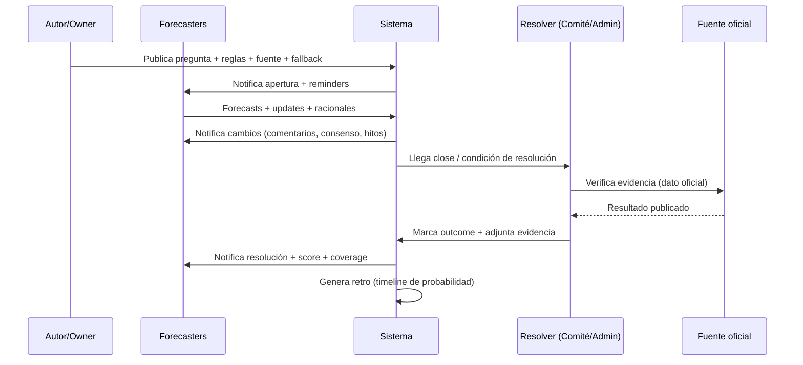

# Sitios de predicciones para uso corporativo: análisis profundo y blueprint de implementación

## Resumen ejecutivo

Tu pedido tiene una tensión creativa (y útil): querés **predicciones “no apuestas”**, pero pediste priorizar **polymarket.com** y **kalshi.com**, que son **mercados con dinero real** (en Kalshi, además, con estructura regulada). Mi lectura práctica: tomarlos como **referentes de UX + señal probabilística** (inputs), y diseñar internamente algo más parecido a **torneos de forecasting** (no-money) para el loop organizacional. citeturn3view3turn4view0turn21view0turn26view0

Conclusiones duras (pero accionables):

- **Para “señal externa en tiempo real”**, polymarket.com y kalshi.com son fuertes por **precio↔probabilidad** + **liquidez/actividad** + **APIs**. Polymarket destaca por stack cripto + oráculo descentralizado (UMA) y por exponer métricas/leaderboards; Kalshi destaca por documentación de exchange (REST/WebSocket/FIX/SDKs), demo environment y un modelo tipo “rulebook/source agency” de resolución. citeturn3view3turn3view2turn31view3turn31view4turn12view0turn6view1
- **Para “aprendizaje organizacional continuo”**, el patrón ganador no es “trading”, sino **scoring + racionales + reforecasting** (tipo entity["organization","Metaculus","forecasting platform"] / entity["organization","Good Judgment Open","forecasting platform"] / entity["organization","Hypermind","crowd forecasting vendor"] / entity["organization","INFER","us gov forecasting program"]). Esto habilita KPIs (Brier/Calibration/Coverage), retrospectivas, y auditoría de promesas con fricción baja y sin líos regulatorios de apuestas internas. citeturn23view0turn24view0turn24view3turn26view0turn28view0turn29view1
- **Riesgo/regulatorio**: hoy el tablero cambia rápido. Para Kalshi hay conflictos estado–federal (ej. orden temporal en Nevada; cargos en Arizona). Para Polymarket: antecedente de enforcement en 2022 y, a la vez, existencia de una vía regulada en EE. UU. vía Polymarket US (designated contract market). Operativamente, esto impacta: geoblocking, elegibilidad, compliance, y reputación. citeturn36news33turn36news36turn35search3turn35search0turn10view0

Recomendación principal:

- Montar un **“Forecasting Layer corporativo”** (no apuestas) con: preguntas bien especificadas, scoring propio (Brier/log), dashboards de calibración, notificaciones, y “promises audit”; y, en paralelo, un **conector de señales externas** que consuma probabilidades/series desde Polymarket/Kalshi (cuando legal/compliance lo permita) para enriquecer decisiones (roadmaps, riesgo, pricing, operaciones). citeturn24view5turn4view2turn3view3turn4view1

## Marco de evaluación y hallazgos transversales

### Tipos de plataformas: “mercado” vs “torneo”
En la práctica hay dos familias:

1) **Mercados de predicción (con trading)**  
La probabilidad vive en el **precio** (contratos tipo “Yes/No”), con señales útiles como volumen, spread, profundidad, concentración de posiciones y cambios rápidos ante info nueva. Esto es lo que ves en polymarket.com y kalshi.com. citeturn34view0turn4view4

2) **Plataformas de forecasting (con scoring)**  
La probabilidad vive en el **input directo** del usuario (0–100% o distribuciones), y el incentivo es **precisión** (Brier / log score / variantes). Este modelo es naturalmente más “corporate friendly” porque se parece a un sistema de performance/learning, no a un exchange. citeturn23view0turn26view0turn29view1turn28view0

La evidencia académica base (por si necesitás justificarlo internamente): los mercados de predicción pueden agregar información dispersa y producir pronósticos competitivos; también abren preguntas de diseño (liquidez, manipulación, incentivos, etc.). citeturn2search2turn2search20

### Lo que de verdad importa para un proyecto corporativo
Si el objetivo es que el sistema **cambie decisiones**, no alcanza con “ver probabilidades”. Necesitás tres cosas:

- **Calidad de preguntas y resolución determinística**: criterio de resolución claro, fuentes, edge cases, y fallback. (Esto aparece como principio explícito en guías de escritura de preguntas y en el diseño de reglas.) citeturn16view3turn3view2turn12view1turn29view1
- **Loop de feedback**: notificaciones cuando pasa algo (nuevo comentario, cambio grande de consenso, resolución), score individual/cohort, y una cadencia de revisiones. citeturn24view0turn12view0turn15view0
- **Trazabilidad + gobernanza**: quién preguntó, quién “posee” la pregunta, quién resuelve, qué fuente se usó, qué cambió, y por qué. (El “por qué” son racionales/comentarios.) citeturn29view1turn24view0turn28view0turn27view0

## polymarket.com

### Funcionalidades útiles
**Tipos de mercados/preguntas**  
Polymarket opera con mercados tipo **Yes/No** (tokens/posiciones) y también “familias” de mercados. En el ejemplo de “Bitcoin above ___”, se ve un set de strikes con porcentajes y precios “Buy Yes/Buy No”, más volumen por strike. citeturn34view0

**Resolución y oráculo**  
La resolución se apoya en entity["company","UMA","optimistic oracle protocol"] (Optimistic Oracle): cualquiera puede proponer un resultado con un bond; existe una ventana de challenge; si se disputa, hay votación de tokenholders. Polymarket documenta explícitamente esta mecánica, con énfasis en leer reglas de resolución y en penalidad si proponés mal o temprano. citeturn3view2turn7view0

Lo más valioso para diseño corporativo no es “blockchain sí/no”, sino el patrón:
- **Reglas predefinidas** (fuente, fecha elegible, edge cases). citeturn3view2turn34view0
- **Proceso de disputa** con incentivos y ventana temporal. citeturn3view2turn7view0

**APIs y datos**  
Polymarket separa APIs por propósito:
- **Gamma API** (descubrir/browse: markets, events, tags, series, comments, search, perfiles). citeturn3view3
- **Data API** (posiciones, trades, open interest, leaderboards, analytics). citeturn3view3
- **CLOB API** (orderbook, precios, spreads, price history; y endpoints autenticados para trading). citeturn3view3
- WebSockets con canales de mercado/usuario/sports/RTDS; incluye eventos como `market_resolved`. citeturn3view4

En límites, explicitan rate limits con enforcement vía entity["company","Cloudflare","cdn and security"] y throttling. citeturn3view5

**Métricas de confianza (trust signals)**  
Polymarket expone métricas agregadas de “accuracy” (propias) y también señales de mercado (volumen, etc.). En su página de accuracy publica: Brier score agregado, “accuracy” en snapshots previos a resolución (por ejemplo a 4 horas y 1 mes), y composición de resoluciones Yes/No. Importante: describen metodología (snapshots 1 mes/1 semana/1 día/12h/4h). citeturn9view0

También expone rankings con Profit/Loss y Volume, además de “biggest wins”, que funcionan como señal social (y también como riesgo de concentración). citeturn32view1

### Impacto visual y engagement
Lo más copiar-pegar para uso corporativo (sin el componente “apuesta”) es el set de patrones UI:

- **Tarjetas comparables** por opciones/strikes con probabilidad (%) + “precio” + volumen. citeturn34view0  
- **Reglas visibles y repetibles**: el mercado incluye una sección “Rules/Market Context” con la fuente de resolución (ej. una referencia a Binance BTC/USDT “Close” y el timestamp). citeturn34view0  
- **Transparencia operacional**: se muestra “Market Opened”, “End Date”, volumen total, y “Resolver” con link a proponer resolución. citeturn34view0turn3view2  
- **Rewards**: “Daily Rewards” por colocar limit orders competitivas (incentivo a liquidez). citeturn32view0  
- **Activity feed**: stream público de actividad de trades (quién compró/vendió, a qué precio). citeturn9view1

### Restricciones y riesgos relevantes en entorno corporativo
**Geoblocking / disponibilidad**  
Polymarket documenta un endpoint de geoblock y explica que restringe order placement por razones regulatorias (sanciones, AML/KYC, leyes locales, etc.). Esto es crítico si lo querés usar como “fuente externa” en una app corporativa: necesitás decidir qué pasa cuando un usuario/servicio cae en región bloqueada. citeturn10view0

**Regulatorio (EE. UU.)**  
En 2022, la entity["organization","Commodity Futures Trading Commission","us derivatives regulator"] anunció una orden que exige a Polymarket pagar una multa civil y “wind down” mercados no conformes, además de un cease-and-desist. citeturn35search3

A la vez, existe una vía “US-regulated”: la CFTC lista a **QCX LLC d/b/a Polymarket US** como **Designated Contract Market** (status “Designated”, fecha 2025-07-09). citeturn35search0

Para tu proyecto, el takeaway no es “sí/no usarlo”, sino: **la arquitectura debe ser compliance-aware** (región, elegibilidad, data licensing, vendors), y tu output interno tiene que poder funcionar aunque el conector externo esté parcial o totalmente deshabilitado.

## kalshi.com

### Funcionalidades útiles
**Modelo de producto**  
Kalshi se describe como exchange regulado donde contratos valen $1 si estás correcto. La UX formaliza “Markets / Events / Series” (tickers), y expone reglas y timeline/payout. citeturn15view3turn4view1turn4view3turn4view6

**Resolución y “oráculo” tipo rulebook**  
En lugar de un oráculo descentralizado, Kalshi tiene un esquema “rulebook + comité”:
- El rulebook define un **Market Outcome Review Process**: antes del settlement, Kalshi puede iniciar revisión; el **Outcome Review Committee** determina outcome final; hay un plazo (24h) y la decisión es final, con aviso en el sitio si está “under review”. citeturn6view1  
- También contempla casos donde no puede determinarse el payout criterion: puede usar último precio tradeado o, si no es representativo, el comité define una “fair allocation”. citeturn6view0

Esto es oro puro para corporativo porque es un patrón replicable: **“resolución editorial con fuentes + proceso de review + handling de contingencias”**.

**Market FAQs y operación visible**  
El Help Center da detalles útiles:
- “Most markets settle within a few hours (often ~3 hours)” y a veces tarda más por esperar datos oficiales (source agencies) y por reglas/determination time. citeturn12view0  
- Notificaciones: se pueden activar email/app notifications cuando un mercado que poseés se asienta. citeturn12view0  
- Combos: describe un workflow RFQ (“submit request → quotes → accept → se crea order book”), y que el settlement de combos puede tardar más por revisión adicional. citeturn12view0

### APIs, escalabilidad de datos y seguridad técnica
Kalshi tiene un set de documentación típicamente “exchange-grade”:

- **REST + WebSockets + FIX** (con SDKs oficiales). citeturn4view0turn31view4turn30search4  
- **Mercado público sin auth** para datos (ejemplo en quick start, con base URL `api.elections...` y aclaración de que incluye todas las categorías). citeturn4view1  
- **WebSockets** para orderbook/trades/status/fills, con listado explícito de canales públicos y privados. citeturn31view3  
- **Auth**: API keys con firma (RSA) y headers específicos; la doc aclara incluso qué firmar (path sin query params). citeturn31view2  
- **Rate limits por tiers** (Basic/Advanced/Premier/Prime) con requisitos de competencia técnica para tiers altos. citeturn31view0  
- **Datos históricos**: particiona live vs historical, con cutoffs consultables y ventana objetivo (~3 meses live; inicial 1 año). Esto es una decisión arquitectónica fuerte que conviene copiar si tu sistema interno va a acumular series grandes. citeturn4view2  
- **Demo environment** con fondos mock y root separado. Ideal para integración corporativa sin riesgos. citeturn31view5

### Componentes visuales y engagement (más “producto social” de lo que parece)
Kalshi tiene features de “comunidad” explícitos:

- **Kalshi Ideas**: un “community hub” para compartir perspectivas, postear y comentar, sujeto a community guidelines; con moderación y derecho de limitar acceso. citeturn15view0  
- **Ideas profile**: nickname, photo y descripción; y una restricción “nickname sólo cada 30 días” (anti-abuse + estabilidad de identidad social). citeturn15view1

Para diseño corporativo, la lección es clara: si querés engagement real, necesitás un “lugar” para racionales y discusión que no sea Slack disperso.

### Riesgo regulatorio reciente (impacta due diligence y continuidad)
A nivel federal, la CFTC designó a KalshiEX LLC como Designated Contract Market (orden de 2020). citeturn36search0

Pero a nivel estatal hay fricción: un juez en entity["state","Nevada","us state"] emitió una orden temporal bloqueando a Kalshi de operar ciertos event contracts en el estado (según Reuters). citeturn36news33  
Y en entity["state","Arizona","us state"] hubo cargos criminales estatales contra Kalshi por operación de gambling ilegal (según AP). citeturn36news36

Bonus importante para contexto regulatorio: el entity["organization","Federal Register","us government journal"] publicó que la CFTC retiró formalmente un NPRM sobre “Event Contracts” (no habrá regla final bajo esa propuesta). Esto sugiere volatilidad normativa y necesidad de monitoreo continuo. citeturn36search13

## Comparativa con alternativas “no apuestas” y patrones reutilizables

### Plataformas analizadas extra (orientadas a learning loop)
- entity["organization","Metaculus","forecasting platform"]: forecasting + track record + scoring avanzado + API (incluye conceptos como Peer Score/Baseline y notificaciones muy completas). citeturn23view0turn24view0turn24view4turn24view5  
- entity["organization","Good Judgment Open","forecasting platform"]: challenges + leaderboard, scoring basado en Brier y “Relative Brier” contra el crowd; incluye gráficos de consenso y badges que gamifican contribución. citeturn26view0turn26view1  
- entity["organization","Manifold Markets","social prediction platform"]: “social prediction game” con play-money, quests/referrals, moderación y API con restricciones de scraping y licensing de datos; notifica resoluciones y actividad. citeturn27view0turn27view1turn27view3  
- entity["organization","Hypermind","crowd forecasting vendor"]: producto enterprise (Prescience) con SSO, cohorts, dashboards/leaderboards/message boards, email notifications, variedad de tipos de preguntas y modos de scoring (incluye rolling ground truth y sistemas de incentivos). citeturn28view0  
- entity["organization","INFER","us gov forecasting program"] (liderado por entity["organization","RAND","think tank"] con soporte de entity["organization","Cultivate Labs","forecasting company"]): foco en early warning; racionales; agregación que empieza en mean y evoluciona a weighting por track record; y diseño de interfaces “rolling” con intervals para usabilidad. citeturn29view0turn29view1turn29view2  
- Conexión histórica: entity["organization","Center for Security and Emerging Technology","think tank"] explica cómo Foretell se integró a INFER y el enfoque “escenarios → predictores → métricas → crowd forecast → trend departures”, muy aplicable a OKRs/roadmaps. citeturn29view3

### Tablas comparativas

#### Funcionalidades core, resolución y APIs

| Plataforma | Modelo | Tipos de preguntas / mercados | Resolución / “oráculo” | APIs y datos | Señales de confianza más accionables |
|---|---|---|---|---|---|
| polymarket.com | Mercado (trading) | Mayormente binario; familias/strikes; reglas por mercado | UMA Optimistic Oracle (propose/dispute/vote) | Gamma/Data/CLOB + WebSockets; rate limits; geoblock | Volumen, spreads/orderbook, open interest/holders (API), auditoría/“Resolver”, accuracy/Brier agregado |
| kalshi.com | Exchange regulado (trading) | Mercados binarios; series; combos (RFQ) | Rulebook + Outcome Review Committee; Market Outcome Review Process | REST + WebSockets + FIX + SDKs; demo env; live/historical tiering | Volumen/open interest (según endpoints), orderbook, status/settled, trazabilidad vía rules + source agency |
| Metaculus | Torneo/scoring | Binary, numeric, date, multiple choice, discrete | Admin/editorial; resolución por criterios, permite re-resolution en casos | REST API (v2) + modelo posts/questions/forecasts | Brier/calibration, Peer Score/Baseline, coverage, track record y cohort performance |
| Good Judgment Open | Torneo/scoring | Multi-opción y binario; “open questions” no scoreadas | Editorial, al resolverse se scorea | (No énfasis en APIs públicas en FAQ) | Relative Brier vs crowd; trends de consenso; participación (participation rate) |
| Manifold Markets | Juego social (play-money) | Amplio; creador-resuelve con moderación; múltiples formatos | Creador/mods; posibilidad de re-resolve ante abuso | API pública + términos (anti scraping; licensing) | Reputación social + moderación; auditoría de actividad; señales de bots/mods |
| Hypermind (Prescience) | Enterprise (scoring + incentivos) | Binary, WTA, ordered, graded, continuous | Múltiples modos: fixed/rolling/drip/Bayesian inferential | Implementación brandable; integración/SSO | Dashboards + segmentación por cohorts + scoring/feedback + alarmas |
| INFER | Programa/torneo (scoring) | Probabilidades 0–100% + racionales; formatos avanzados (rolling) | Team con discreción final; fuentes autoritativas | Ecosistema de plataformas; foco en agregación y feedback | Net Brier Points; track record; early warning via señales agregadas |

Fuentes base para esta tabla: Polymarket docs/API/resolution/geoblock citeturn3view3turn3view2turn10view0turn3view4, Kalshi docs/help/rulebook citeturn4view0turn4view2turn12view0turn6view1turn31view4, Metaculus docs citeturn23view0turn24view5turn24view1turn24view3, GJ Open FAQ citeturn26view0turn26view1, Manifold docs/API/privacy citeturn27view0turn27view1turn27view3, Hypermind Prescience citeturn28view0, INFER FAQ/blog citeturn29view1turn29view2.

#### Componentes visuales y engagement

| Plataforma | Visualización de probabilidad | Timeline / status | Notificaciones | Social (comentarios/ideas) | Gamificación / reputación |
|---|---|---|---|---|---|
| polymarket.com | % + buy yes/no + (típicamente) chart; listas comparables | Market opened/end date visibles por mercado | (No documentado en páginas públicas revisadas; se infiere vía apps/terceros) | Comentarios vía Gamma API; activity feed público | Rewards (liquidez) + leaderboard P/L y volumen |
| kalshi.com | Dashboard/mercados; “Timeline and Payout” en cada market | Close vs determination vs payout; status “settled” | Email/app notifications (settlement) | Kalshi Ideas + profile social | Incentivos/programas; prácticas de producto tipo exchange |
| Metaculus | Curvas de calibración + track record + agregados | Open/close/resolve; milestone-driven | Tipos muy ricos: resolución, comentarios, cambios de CP, reminders | Comentarios con spotlight semanal | Leaderboards + scoring competitivo + “Top Comments” |
| Good Judgment Open | “Probability Over Time” (consenso) | Por pregunta y por challenge | Notificaciones mencionadas (unfollow afecta) | Comentarios y racionales (moderables) | Badges (racionales, volumen, rankings) |
| Manifold Markets | Probabilidad/precio con UX de juego | Close vs resolved; re-resolve por abuso | Comunicaciones (market resolutions, activity) | Social fuerte (predicciones públicas, comments) | Quests, referrals, streaks |
| Hypermind | Dashboards performance + cohorts | Rolling ground truth / drip rewards | Alarmas por email | Message boards | Reward schemes configurables |
| INFER | UX de forecast + racionales; rolling formats | Scoring periódico (rolling) | Alertas por nuevas preguntas | Racionales como insumo a policy | Leaderboards (Net Brier Points) |

Fuentes base: Polymarket rewards/leaderboard/market rules citeturn32view0turn32view1turn34view0, Kalshi Help (timeline, FAQs, Ideas/profile) citeturn4view6turn12view0turn15view0turn15view1, Metaculus Notifications/Track Record/Calibration citeturn24view0turn24view1turn24view3, GJ Open graphs/badges citeturn26view1, Manifold privacy & quests/streaks (API user model) citeturn27view1turn27view3, Hypermind Prescience citeturn28view0, INFER FAQ/blog citeturn29view1turn29view2.

### Un “mini álbum” visual para alinear a stakeholders
(Útil para que producto/ejecución visualice rápido cómo se ven estas cosas en la práctica.)

image_group{"layout":"carousel","aspect_ratio":"16:9","query":["Polymarket market page probability chart screenshot","Kalshi Timeline and Payout section screenshot","Metaculus calibration curve screenshot","Good Judgment Open consensus graph screenshot"],"num_per_query":1}

## Recomendaciones prácticas y plan de implementación inicial

### Propuesta de arquitectura: “Forecasting Layer” + conectores de señal externa
El diseño que mejor cierra para corporativo suele ser:

- **Interno (core)**: preguntas privadas (por equipo/proyecto), scoring, racionales, cohorts, auditoría, integración con roadmap/OKRs.  
- **Externo (opcional)**: ingest de probabilidades/series de Polymarket/Kalshi como “señal del mundo”, sin necesidad de que empleados “tradearan”. APIs y partición histórica hacen esto viable. citeturn3view3turn4view2turn24view5turn31view5

```mermaid
flowchart LR
  subgraph Users[Usuarios internos]
    PM[Product Managers]
    ENG[Engineering/Execution]
    LEAD[Leaders]
  end

  subgraph Core[Forecasting Layer corporativo]
    UI[Web/App interna]
    SSO[SSO OIDC/SAML]
    Q[Question Service<br/>reglas + metadatos]
    F[Forecast Service<br/>inputs + updates]
    R[Rationale/Comments Service]
    RES[Resolution Service<br/>fuentes + comité]
    SCORE[Scoring & Calibration<br/>Brier/log + coverage]
    NOTIF[Notifications<br/>email/Slack/Push]
    AUD[Audit Log<br/>trazabilidad]
  end

  subgraph Data[Data Platform]
    TS[(Time-series store)]
    DW[(Data warehouse)]
    BI[Dashboards BI]
  end

  subgraph External[Señales externas (opcional)]
    PMK[Polymarket APIs]
    KSH[Kalshi API/WebSocket/FIX]
  end

  Users --> UI --> SSO --> Q
  UI --> F --> TS
  UI --> R --> DW
  Q --> RES --> DW
  F --> SCORE --> DW
  SCORE --> NOTIF --> Users
  Q --> AUD
  F --> AUD
  RES --> AUD

  PMK --> TS
  KSH --> TS
  DW --> BI
```

### Flujo UX recomendado (para maximizar adopción sin “fricción de proceso”)
Inspirado en patrones que ya funcionan (notifs ricos, track record, ideas/social, reglas claras). citeturn24view0turn24view1turn15view0turn3view2turn12view1

```mermaid
flowchart TD
  A[Crear pregunta] --> B[Especificar resolución<br/>fuente + timestamp + edge cases]
  B --> C[Asignar owner + cohorts<br/>y visibilidad]
  C --> D[Abrir forecasting]
  D --> E[Usuarios pronostican<br/>+ escriben racional]
  E --> F[Notificaciones<br/>cambios grandes / menciones / reminders]
  F --> G[Usuarios actualizan forecast<br/>cuando cambia info]
  G --> H[Cierra ventana (close)]
  H --> I[Resolución (owner/comité)<br/>con evidencia]
  I --> J[Score + calibración + coverage]
  J --> K[Post-mortem automático<br/>“qué creíamos vs qué pasó”]
  K --> L[Acción: update en roadmap/OKR<br/>y “promises audit”】【L --> A]
```

### Timeline de resolución: tres patrones (y cuándo usar cada uno)
La resolución es donde mueren (o viven) estos sistemas. Tres enfoques que podés mezclar según criticidad:

- **Oráculo descentralizado** (estilo UMA): bueno para transparencia, malo para simplicidad interna si no necesitás blockchain. citeturn3view2turn7view0  
- **Rulebook + comité** (estilo Kalshi): bueno para compliance y determinismo; requiere gobernanza clara. citeturn6view1turn12view1  
- **Editorial admin** (estilo Metaculus/INFER): bueno para velocidad y escalabilidad; requiere disciplina en criterios y “tiempo de admin”. citeturn16view3turn29view1



### Requisitos técnicos y de datos (checklist que evita sorpresas)
Puntos que yo trataría como no-negociables:

- **Modelo de datos** (mínimo): `Question/Market`, `Option`, `ResolutionCriteria`, `Source`, `Forecast(time series)`, `Rationale`, `User`, `Cohort`, `Score`, `Notification`, `AuditEvent`. Esto es consistente con modelos públicos (posts/questions/forecasts en Metaculus) y con separación live/historical (Kalshi). citeturn24view5turn4view2turn23view0  
- **Trazabilidad**: todo update de forecast y toda resolución debe quedar en audit log (quién, cuándo, qué cambió, link a evidencia). “Racional” no opcional para forecasts críticos. citeturn29view1turn16view3  
- **Privacidad y visibilidad**: preguntas privadas por dominio/cohort (patrón de “domains”) o instancias privadas; SSO y RBAC. citeturn16view0turn28view0  
- **Seguridad**: SSO + MFA (si aplica), cifrado at rest/in transit, y hardening de integraciones. Si integrás APIs tipo exchange, copiar el estándar de signing/keys y separar demo/prod. citeturn31view2turn31view5  
- **Escalabilidad**: particionar series históricas (live vs historical tier) y cachear/paginar. citeturn4view2turn30search11  
- **Compliance-awareness en conectores externos**: geoblock y disponibilidad regional (Polymarket lo documenta explícito). citeturn10view0turn35search3

### Métricas de éxito y KPIs recomendados
Acá conviene medir dos cosas: **adopción** y **calidad**.

**Adopción / engagement**
- `% de usuarios activos por cohorte` (WAU/MAU del módulo)
- `# forecasts por pregunta` y `# updates por usuario` (la actualización frecuente correlaciona con accuracy en programas de forecasting). citeturn29view1turn24view1  
- `Coverage` (tiempo activo del forecast): Metaculus lo trata como señal explícita en notificaciones y scoring. citeturn24view0turn24view4  
- `Racional rate`: % forecasts con racional (y % con links/evidencia). INFER enfatiza que racionales suman valor para decisión. citeturn29view1  
- `Time-to-first-forecast` desde que se publica una pregunta (fricción real)

**Calidad / confiabilidad**
- **Brier score** por cohorte y global (y por “horizonte” de tiempo). citeturn26view0turn29view1turn9view0  
- **Calibración** (curva tipo reliability): Metaculus detalla cómo leerla y cómo la calcula (bins, intervalos). citeturn24view3  
- **Sharpness** (distribución menos “todo 50%”) sin caer en overconfidence
- **Lift vs baseline**: peer score/baseline score (Metaculus) o relative vs crowd (GJ Open). citeturn24view4turn26view1  
- **Resolution SLA**: tiempo desde “outcome conocido” hasta “resolved” (Kalshi apunta a horas; es una buena referencia). citeturn12view0  

**Impacto en ejecución (el KPI que le importa a liderazgo)**
- `# decisiones donde se citó forecast` (en PRDs, postmortems, QBRs)
- `delta de roadmap`: cuántos cambios de prioridad se gatillaron por umbrales probabilísticos
- `promises audit`: % de compromisos (internos) que fueron “early flagged” por forecasts con probabilidad <X%

### Roadmap estimado de implementación (en fases)
Un plan razonable, evitando “big bang”, es:

**Fase de alineación (1–2 semanas)**  
Definir taxonomía de preguntas (producto, operación, riesgo), owners, y estándar de resolución (“rulebook interno”). Usar las guías de criterios/edge cases como plantilla. citeturn16view3turn3view2turn12view1

**MVP (4–8 semanas)**  
- CRUD de preguntas + visibilidad + cohorts  
- Forecast input + updates  
- Racional/comentarios  
- Notificaciones mínimas (reminder, mention, resolved + score) inspiradas en Metaculus/Kalshi. citeturn24view0turn12view0  
- Scoring Brier + coverage + dashboard simple

**Piloto (4–6 semanas)**  
2–3 equipos, 20–40 preguntas relevantes, con ceremonia quincenal de “Forecast Review”: qué cambió, por qué, y decisión tomada.

**Escala (trimestre siguiente)**  
- Integraciones: Jira/Linear + Slack + OKR tool (push de “probability gates”)  
- Dashboards de calibración/cohorts y “champion forecasters” (patrón Hypermind) citeturn28view0  
- Conector externo de señales (Polymarket/Kalshi) con control de disponibilidad/geoblock y storage histórico. citeturn3view3turn10view0turn4view2  

## Fuentes principales (URLs)

```text
https://docs.polymarket.com/
https://docs.polymarket.com/api-reference/introduction
https://docs.polymarket.com/concepts/resolution
https://docs.polymarket.com/market-data/websocket/overview
https://docs.polymarket.com/api-reference/rate-limits
https://docs.polymarket.com/api-reference/geoblock
https://polymarket.com/accuracy
https://polymarket.com/rewards
https://polymarket.com/leaderboard

https://docs.kalshi.com/welcome
https://docs.kalshi.com/getting_started/quick_start_market_data
https://docs.kalshi.com/getting_started/historical_data
https://docs.kalshi.com/getting_started/rate_limits
https://docs.kalshi.com/getting_started/api_keys
https://docs.kalshi.com/getting_started/demo_env
https://docs.kalshi.com/getting_started/quick_start_websockets
https://docs.kalshi.com/fix
https://help.kalshi.com/en/articles/13823821-market-faqs
https://help.kalshi.com/en/articles/13823825-timeline-and-payout
https://help.kalshi.com/en/articles/13823843-what-is-kalshi-ideas

https://www.cftc.gov/PressRoom/PressReleases/8478-22
https://www.cftc.gov/IndustryOversight/IndustryFilings/TradingOrganizations/49571
https://www.cftc.gov/PressRoom/PressReleases/8302-20
https://www.cftc.gov/IndustryOversight/IndustryFilings/TradingOrganizations/42993
https://www.cftc.gov/sites/default/files/filings/orgrules/24/11/rules1114248723.pdf
https://www.federalregister.gov/documents/2026/02/06/2026-02454/event-contracts-withdrawal-of-proposed-regulatory-action

https://metaculus-metaculus.mintlify.app/introduction
https://metaculus-metaculus.mintlify.app/guides/question-types
https://metaculus-metaculus.mintlify.app/guides/notifications
https://metaculus-metaculus.mintlify.app/guides/track-record
https://metaculus-metaculus.mintlify.app/advanced/calibration
https://metaculus-metaculus.mintlify.app/advanced/scoring-algorithms
https://metaculus-metaculus.mintlify.app/api/overview
https://www.metaculus.com/question-writing/

https://www.gjopen.com/faq
https://docs.manifold.markets/faq
https://github.com/manifoldmarkets/manifold/blob/main/docs/docs/api.md
https://docs.manifold.markets/privacy-policy
https://www.hypermind.com/products-services/prescience

https://www.randforecastinginitiative.org/about-infer
https://www.randforecastinginitiative.org/faq-2022
https://www.randforecastinginitiative.org/blog/rolling-question-formats
https://cset.georgetown.edu/publication/future-indices/

https://pubs.aeaweb.org/doi/10.1257/0895330041371321
https://www.iarpa.gov/newsroom/article/iarpa-announces-publication-of-data-from-the-good-judgment-project
```